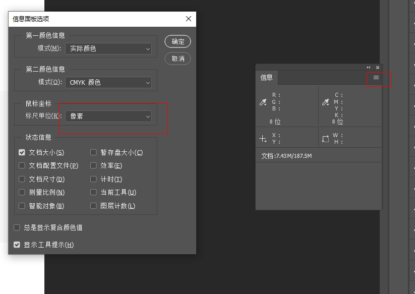
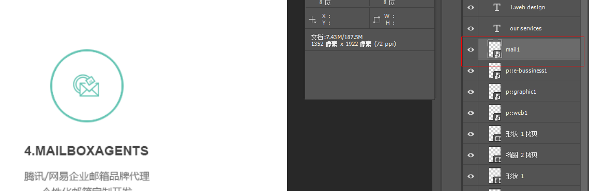
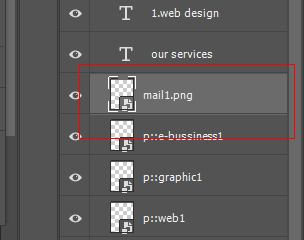

# PS 使用

## 信息面板

1. 在 窗口 ==> 信息选项，调出信息面板
2. 信息面板选项中设置单位为像素

## 测试间距

1. 选择图层，确认起始元素
2. 左侧工具栏选择移动工具
3. 按住 ctrl ，鼠标选择目标元素

## 选择字符

1. 左侧工具栏选择移动工具
2. 双击选择文字

## 切图

1. 编辑 ==> 首选项 ==> 增效工具 ==> 勾选启动生成器
2. 文件 ==> 生成 ==> 选择图形资源
3. 双击图片对应的图层，修改名称，名称后缀为图片类型，回车确认
4. 在 psd 对应的目录里会生成 assets 目录

倍图：在名称前面价 200% + 空格 即生成2倍图

## 标尺

视图 ==> 标尺