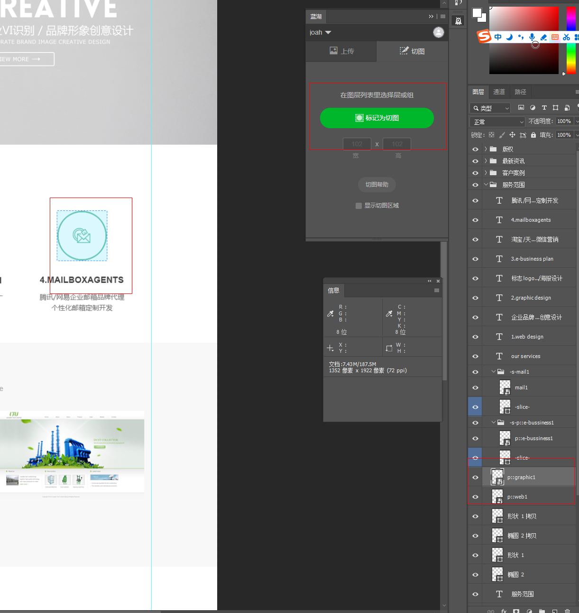

# 蓝湖搭配PS

1. [下载，安装 ps 插件](https://lanhuapp.com/ps?comeFrom=%E9%A1%B9%E7%9B%AE%E5%88%97%E8%A1%A8_%E5%8F%B3%E4%B8%8A)

2. 新建项目

3. 打开 PS ==> 窗口 ==> 扩展功能 ==> 选择蓝湖 ==> 登录蓝湖账号  ==> 选择设计稿尺寸以及上传目标项目

## 在蓝湖上下载 UI 稿里的图片

1. 选择图片对应的图层
2. 点击切图 ==> 标记
3. 重新上传

