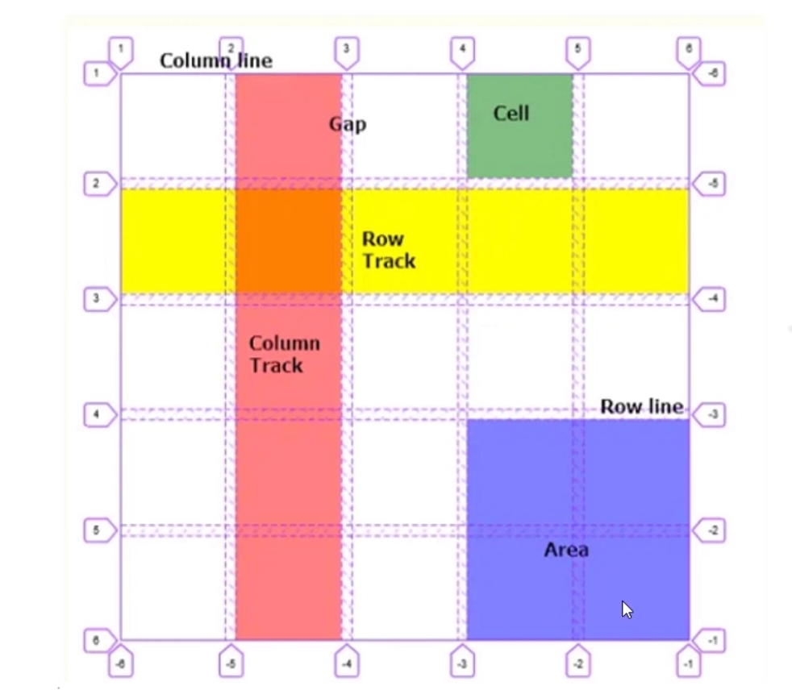

# grid

## grid 容器

- gird-template-rows
- grid-template-columns
- grid-template-areas
- grid-template
- grid-row-gap
- grid-column-gap
- grid-gap

- justify-items
- align-items
- place-items
- justify-content
- align-content
- place-content
- grid-auto-flow
- grid-auto-rows
- grid-auto-columns

1. [gird-template-rows 和 grid-template-columns：基于网格行和列的维度，去定义网格线的名称和网格轨道的尺寸大小](1.html)。
2. [grid-template-areas：合并网格及网格命名。使用命名方式定义网格区域，需配合 grid-area 属性进行使用](2.html)。
3. [grid-template：gird-template-rows grid-template-columns grid-template-areas 的缩写](2.html)。
4. [grid-row-gap，grid-column-gap，grid-gap: 用来设置行列之间的间隙大小，推荐使用 row-gap，column-gap，gap](3.html)。
5. [justify-items，align-items，place-items: 默认值 stretch，指定子项在网格中的对齐方式](4.html)
6. [justify-content，align-content，place-content: 默认值 stretch，指定所有网格在 grid 容器中的对齐方式](5.html)
7. [grid-auto-flow，grid-auto-rows，grid-auto-columns: 指定在显示网格之外的隐式网格，如何排列及尺寸大小](6.html)

## grid 子项

- grid-area
- grid-column-start
- grid-column-end
- gird-row-start
- grid-row-end

- justify-self
- align-self
- place-self
- grid-row
- grid-column

1. [grid-column-start, grid-column-end, grid-row-start, grid-row-end: 基于线的元素位置。表示 grid 子项所占据的区域的起始和终止位置，包括水平方向和垂直方向](7.html)。
2. [grid-row, grid-column: 基于线对应位置的缩写方式，通过 / 分割](7.html)。
3. [grid-area: grid-row-start, grid-column-start, grid-row-end以及grid-column-end属性的缩写，以及额外支持grid-template-areas设置的网格名称](8.html)。
4. [justify-self: align-self, place-self: 子项对齐方式，和 *-items 用法相同，只不过是操作指定的子项](9.html)。